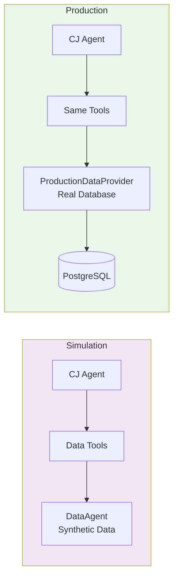

# Daily Flash Briefing Workflow - Architecture Diagram

## Overview
This diagram shows the complete flow of a daily briefing conversation, from initialization through tool usage to conversation output.

```mermaid
graph TB
    %% Initialization Phase
    Start([User: make conversation WORKFLOW=daily_briefing]) --> Init[generate_conversation.py]

    Init --> LoadComponents{Load Components}
    LoadComponents --> |1| LoadWorkflow[WorkflowLoader<br/>loads daily_briefing.yaml]
    LoadComponents --> |2| LoadScenario[ScenarioLoader<br/>loads growth_stall]
    LoadComponents --> |3| LoadPrompts[PromptLoader<br/>loads merchant & CJ prompts]

    %% Data Layer Setup
    LoadComponents --> CreateDataAgent[Create DataAgent<br/>merchant: marcus_thompson<br/>scenario: growth_stall]
    CreateDataAgent --> GenerateMetrics[Generate Base Metrics<br/>MRR: $45k<br/>Churn: 5.5%<br/>Tickets: 35]

    %% Agent Creation
    GenerateMetrics --> CreateAgents{Create Agents}
    CreateAgents --> |1| CreateCJ[Create CJ Agent<br/>+ workflow context<br/>+ data tools]
    CreateAgents --> |2| CreateMerchant[Create Merchant Agent<br/>+ scenario context]

    %% Conversation Flow
    CreateAgents --> Turn1[Turn 1: CJ Opens]

    %% CJ First Turn
    Turn1 --> CJTask[CrewAI Task:<br/>Start conversation following workflow]
    CJTask --> CJThinks[CJ Thinks:<br/>Should get daily flash report]
    CJThinks --> UseTool1{Use Tool:<br/>get_daily_briefing}

    %% Tool Execution
    UseTool1 --> DataAgentCall[DataAgent.get_daily_briefing]
    DataAgentCall --> CreateView[Create DailyBriefingView<br/>with trends & metrics]
    CreateView --> FormatView[Format as Flash Report]
    FormatView --> ReturnToCJ[Return formatted data to CJ]

    %% CJ Continues
    ReturnToCJ --> CJAnalyze[CJ Analyzes:<br/>170 at-risk customers]
    CJAnalyze --> UseTool2{Use Tool:<br/>analyze_customer_segment}
    UseTool2 --> DataAgentCall2[DataAgent.get_customer_segment]
    DataAgentCall2 --> CreateSegmentView[Create CustomerSegmentView]
    CreateSegmentView --> ReturnToCJ2[Return segment analysis]

    %% CJ Completes Turn
    ReturnToCJ2 --> CJResponse[CJ Composes Response:<br/>Morning! Here is your flash...<br/>170 at-risk customers...<br/>What is your priority?]

    %% Merchant Turn
    CJResponse --> Turn2[Turn 2: Merchant Responds]
    Turn2 --> MerchantTask[CrewAI Task:<br/>Respond naturally]
    MerchantTask --> MerchantResponse[Marcus:<br/>170 at-risk = $71k ARR!<br/>Need details on engagement<br/>What actions this week?]

    %% Conversation State
    MerchantResponse --> UpdateState[Update Conversation State]
    UpdateState --> AddTopics[Track Topics:<br/>metrics, churn, CAC]
    AddTopics --> ContextWindow[Maintain Context Window<br/>Last 5 messages]

    %% Output
    ContextWindow --> Display[Display Conversation]
    Display --> End([Conversation Complete])

    %% Styling
    classDef init fill:#e1f5fe,stroke:#0288d1,stroke-width:2px
    classDef data fill:#f3e5f5,stroke:#7b1fa2,stroke-width:2px
    classDef agent fill:#e8f5e9,stroke:#388e3c,stroke-width:2px
    classDef tool fill:#fff3e0,stroke:#f57c00,stroke-width:2px
    classDef output fill:#fce4ec,stroke:#c2185b,stroke-width:2px

    class Start,Init,LoadComponents init
    class CreateDataAgent,GenerateMetrics,DataAgentCall,DataAgentCall2,CreateView,CreateSegmentView data
    class CreateCJ,CreateMerchant,CJTask,MerchantTask agent
    class UseTool1,UseTool2,FormatView tool
    class Display,End output
```



## Key Components Explained

### 1. Initialization Phase
- User runs `make conversation WORKFLOW=daily_briefing`
- System loads workflow definition, scenario, and prompts
- All components are prepared for conversation generation

### 2. Data Layer Setup
- **DataAgent** created with merchant + scenario context
- Generates consistent base metrics (MRR, churn rate, etc.)
- Metrics are deterministic based on scenario

### 3. Agent Creation
- **CJ Agent** receives:
  - Workflow context (daily briefing milestones)
  - Data tools (get_daily_briefing, analyze_customer_segment)
  - Conversation history
- **Merchant Agent** receives:
  - Persona (Marcus Thompson - stressed, data-driven)
  - Scenario context (growth stall situation)

### 4. Conversation Flow
- **Turn 1**: CJ starts with workflow
  - Uses `get_daily_briefing` tool → gets formatted metrics
  - Notices concerning pattern → uses `analyze_customer_segment` tool
  - Composes natural response incorporating data

- **Turn 2**: Merchant responds
  - Reacts to specific data points
  - Asks follow-up questions
  - Shows authentic stress about metrics

### 5. Tool Execution Detail
```
CJ calls tool → DataAgent method → Data View created → Formatted response → Back to CJ
```

### 6. State Management
- Conversation tracks mentioned topics
- Context window maintains last 5 messages
- State passed to agents each turn for continuity

## Production Migration

In production, only the Data Layer changes:



The agents, tools, and workflows remain identical - only the data source changes!
