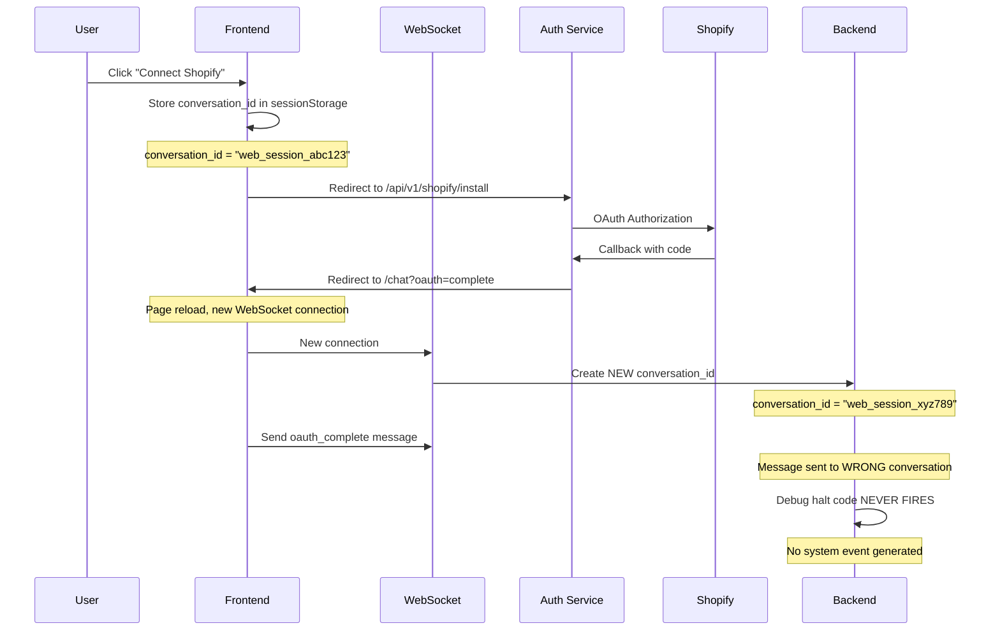

# Current OAuth Flow (Broken)

## Sequence Diagram

## Key Problems

1. **Lost Context**: Page reload creates new WebSocket with new conversation_id
2. **Wrong Target**: oauth_complete sent to wrong conversation
3. **No System Event**: Workflow expects system message, not WebSocket message
4. **Race Condition**: WebSocket might not be ready when oauth_complete sent