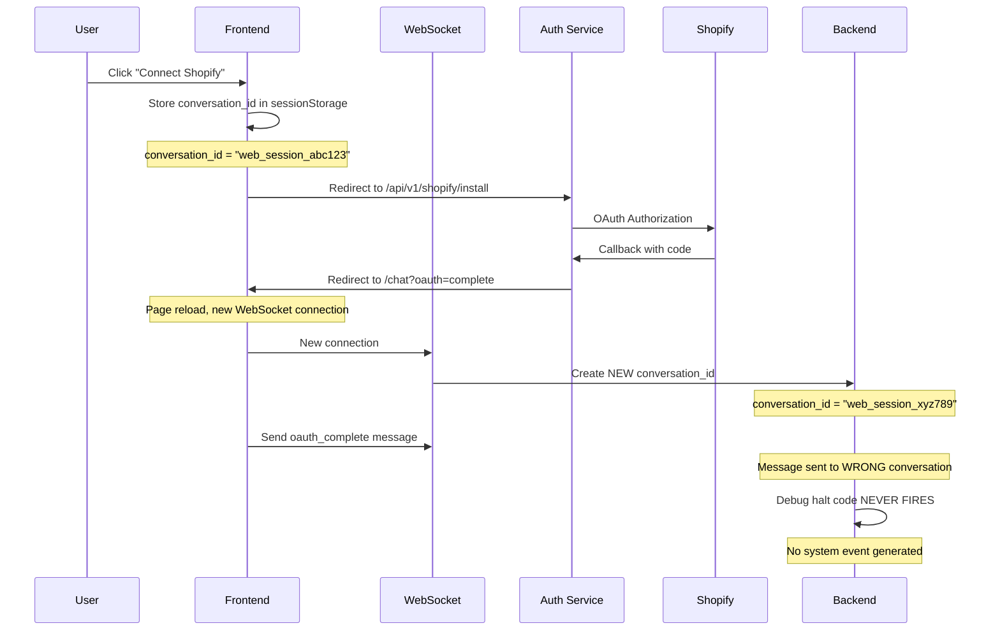
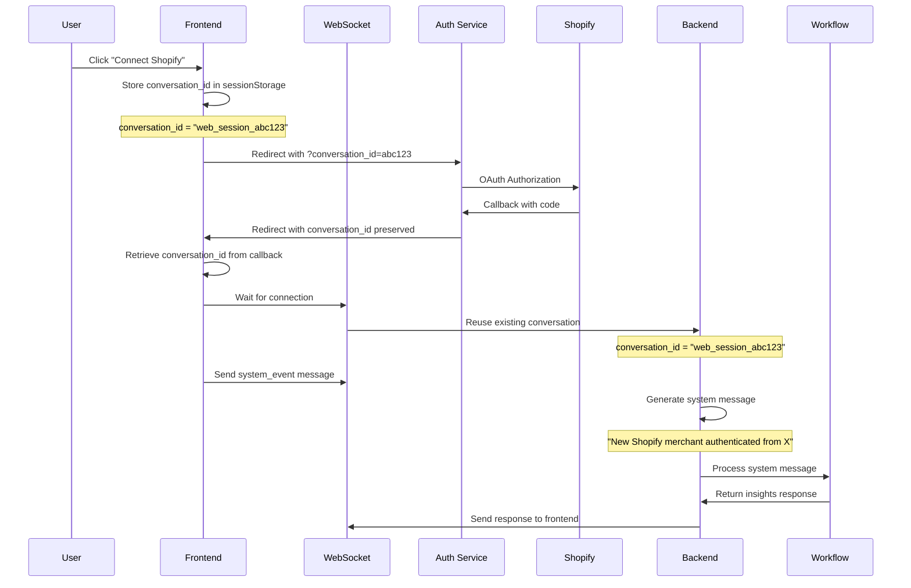

# OAuth Flow Alignment - Phase 5.5.6

## 🚨 Critical Issue Summary

OAuth flow loses conversation context due to page reload. The implementation sends `oauth_complete` WebSocket messages but workflows expect system events with specific messages. Debug code never fires because messages go to wrong conversation.

## 📁 Documentation Structure

```
docs/oauth-flow-fix/
├── oauth-flow-alignment.md    # This document (complete overview)
└── implementation/            # Detailed code changes
    ├── phase-1-frontend.md
    ├── phase-2-backend.md
    └── phase-3-state-param.md
```

## 🌟 North Star Principles (from CLAUDE.md)

1. **Simplify, Simplify, Simplify**: Remove parallel implementations, one way to handle OAuth
2. **No Cruft**: Remove the broken oauth_complete handler completely
3. **Break It & Fix It Right**: No compatibility shims, fix the root cause
4. **Long-term Elegance**: System events are the elegant abstraction
5. **Backend-Driven**: Backend generates system messages, frontend just transports
6. **Single Source of Truth**: One conversation_id throughout the flow
7. **No Over-Engineering**: Simple state preservation, no complex mechanisms

## 📊 Current Flow (Broken)



### Key Problems

1. **Lost Context**: Page reload creates new WebSocket with new conversation_id
2. **Wrong Target**: oauth_complete sent to wrong conversation
3. **No System Event**: Workflow expects system message, not WebSocket message
4. **Race Condition**: WebSocket might not be ready when oauth_complete sent

## 📊 Target Flow (Fixed)



### Key Improvements

1. **Preserved Context**: conversation_id maintained through OAuth
2. **Correct Message Type**: system_event instead of oauth_complete
3. **Proper System Message**: Generates expected workflow trigger
4. **Connection Handling**: Waits for WebSocket before sending

## 🔨 Implementation Checklist

### Phase 1: Frontend Fixes
- [ ] Update useOAuthCallback to retrieve conversation_id from sessionStorage
- [ ] Change SlackChat to send system_event instead of oauth_complete
- [ ] Add retry mechanism for WebSocket connection
- [ ] Test conversation_id preservation

### Phase 2: Backend Alignment  
- [ ] Replace oauth_complete handler with system_event handler
- [ ] Generate proper system message: "New Shopify merchant authenticated..."
- [ ] Remove debug/halt code
- [ ] Test system event flow

### Phase 3: State Parameter (if Phase 1-2 insufficient)
- [ ] Auth service: Accept and preserve conversation_id
- [ ] Frontend: Pass conversation_id to auth service
- [ ] Test full round trip

### Phase 4: Cleanup
- [ ] Remove all oauth_complete code paths
- [ ] Add comprehensive logging
- [ ] Update documentation
- [ ] Test all scenarios

## 🚀 Implementation Timeline

- **Hour 1-2**: Phase 1 Frontend (Quick wins)
- **Hour 3-5**: Phase 2 Backend (Core fix)
- **Hour 6-8**: Phase 3 State Parameter (If needed)
- **Hour 9-10**: Testing & Validation
- **Hour 11-12**: Cleanup & Documentation

## ✅ Success Criteria

1. OAuth returns to same conversation
2. System message "New Shopify merchant authenticated..." generated
3. Workflow responds with insights
4. No debug halt code needed
5. Clean implementation following CLAUDE.md principles

## 📊 Test Scenarios

1. **Happy Path**: Click Connect → OAuth → See insights
2. **Slow Connection**: WebSocket connects after OAuth return
3. **Multiple Tabs**: Only active tab processes OAuth
4. **Session Expired**: Graceful error handling
5. **Page Refresh**: State preserved through reload

## 🎯 Root Cause Analysis

The OAuth flow was designed without considering:
- Stateless nature of HTTP redirects
- Need for conversation continuity across page reloads
- Difference between WebSocket messages and system events
- Workflow expectations for specific system messages

## 🔑 Key Insight

The fix is conceptually simple:
1. Preserve conversation_id through OAuth
2. Send system_event instead of oauth_complete
3. Generate the exact system message workflows expect

This aligns implementation with specification.