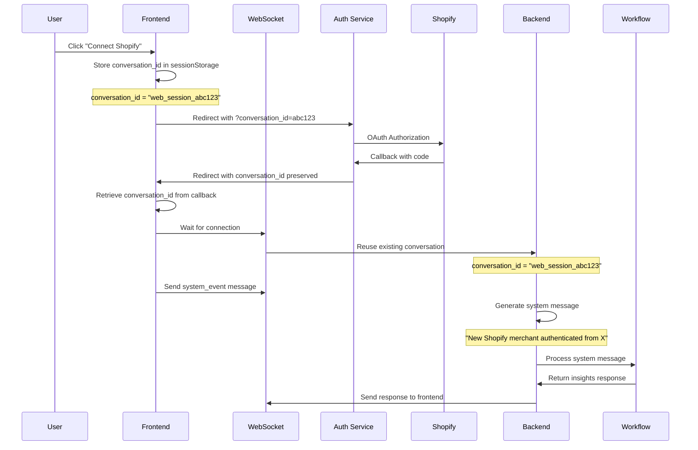

# Target OAuth Flow (Fixed)

## Sequence Diagram

## Key Improvements

1. **Preserved Context**: conversation_id maintained through OAuth
2. **Correct Message Type**: system_event instead of oauth_complete
3. **Proper System Message**: Generates expected workflow trigger
4. **Connection Handling**: Waits for WebSocket before sending